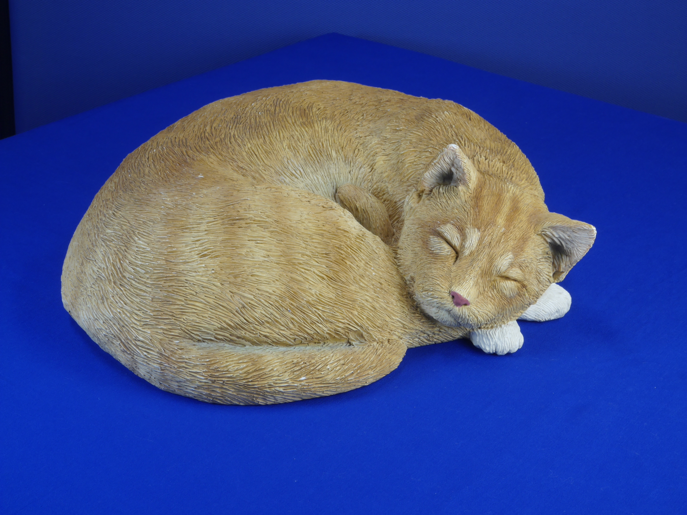
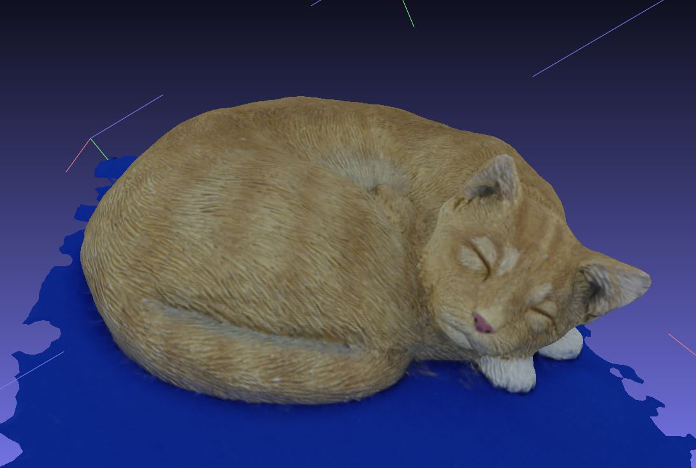
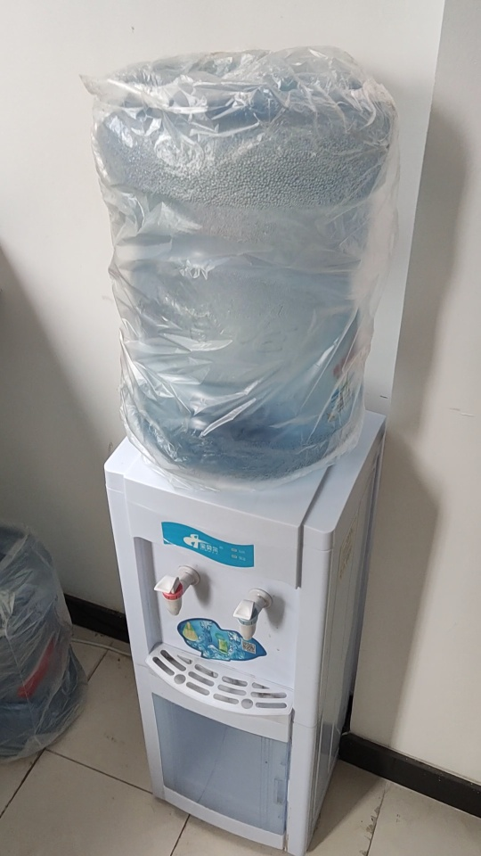
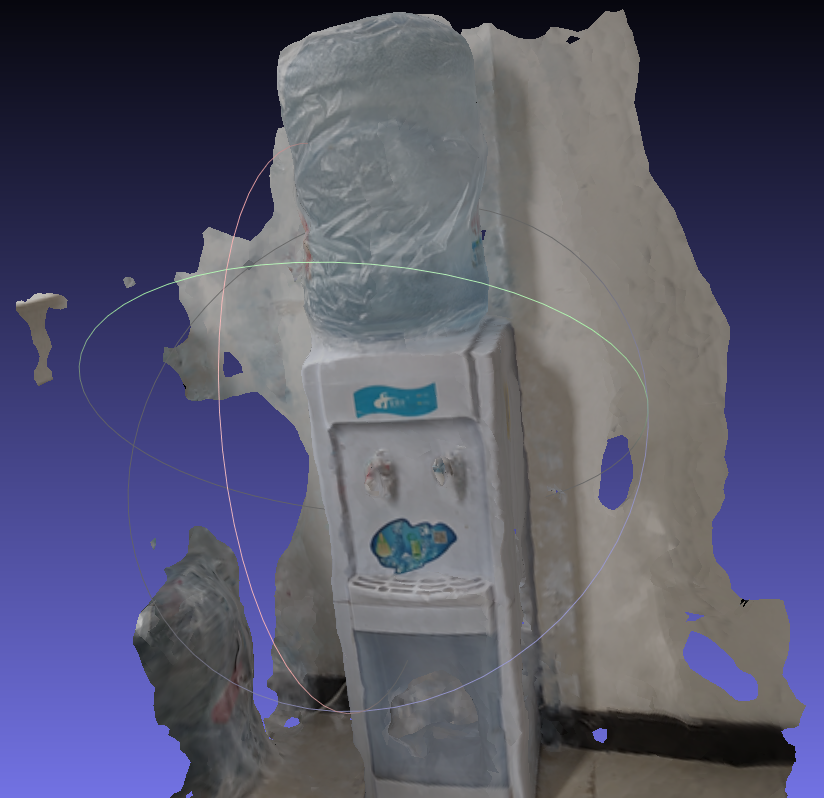
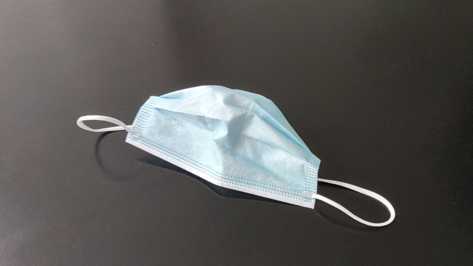
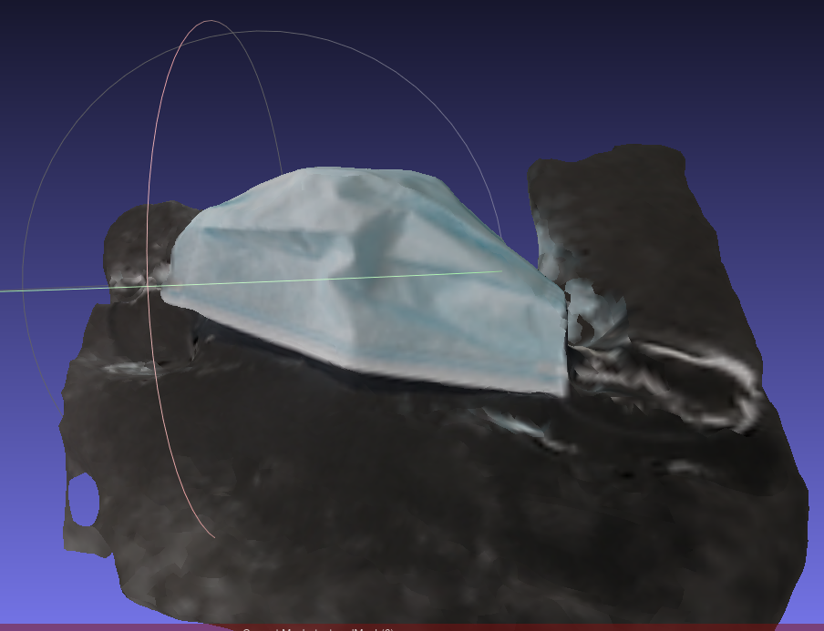

# meshroom CLI #
#### Python script to control the phtogrammetry software Meshroom directly from the command line without the use of its GUI ####


#### Description ####
[Meshroom](#https://alicevision.org/) is an open source tool for creating 3d models out of images, the purpose of this repository is create a code that can use the CLI tool of the software to automate the process of creating 3d meshes.

#### Technologies used: ####
* Python 3.7/3.8
* Meshroom 2020.1.1/2021.1.0

#### Setup ####
The code of the project is located in the Meshroom_CLI.py script, which contains a function for each of the nodes used in Meshroom. The Main function of the script call all the nodes one by one creating folders for each of the steps. 
Additionally, there is a batch file called Run.bat which calls the Main function of the python script with three arguments:
```
python meshroom_CLI.py 
##PATH_TO_BIN_FOLDER_OF_MESHROOM## 
##PATH_OF_FOLDER_TO_PUT_THE_MODEL##
##PATH_OF_FOLDER_WITH_IMAGES##
```
The user should provide 3 paths separated by single blank spaces and using absolute paths , paths should be written inside quotation marks:
* The path to the Bin folder, located in the Meshroom directory /aliceVision (in the 2020.1.1 version)
* The folder for the outputs. If the folder doesn't exist the script will create a new one
* The folder containing the images. It should onnly contain image files and nothing else.

The code can be called used the .bat file (which has to be previously modified with the 3 folders), here is an example:

```
python meshroom_CLI.py "C:\Users\user\Desktop\Meshroom-2020.1.1\aliceVision\bin" "C:\Users\user\Desktop\Output" "C:\Users\user\Desktop\Images"
```

The user can of course call the python file from the command line without using the bat file.

### Output ###
The script generates 13 folders:
* 1_CameraInit
* 2_FeatureExtraction
* 3_ImageMatching
* 4_featureMatching
* 5_structureFromMotion
* 6_PrepareDenseScene
* 7_DepthMap
* 8_DepthMapFilter
* 9_Meshing
* 10_MeshFiltering
* 11_MeshDecimate
* 12_MeshResampling
* 13_Texturing

The final mesh containing the texture(s) should be in the last folder (13_texturing). 

### The script ###
The script contains 13 functions (one for each node). Each function calls a .exe file located in the Bin folder of the Meshroom directory and passes the necesary parameters to run it. In general, all the meshroom functions requiere one or various input files and and output files. Specifically, each function requires some other parameters. For our use, we only set as variables the parameters that we consider to be necesary for our workflow. These parameters are set as parameters in the functions. All the other parameters are hardcoded.


### Small image set ###

for testing purposes, there is a small database of 6 pictures located in /dataset_monstree-master/mini6 . Those files are not needed to run the code and can be dismissed.

### Differences from the original Repo ###
* Rewrite the script to adjust for Linux environment. Tested on Ubuntu 20.04
* Add script to read frames from a video shot, an easier way to prepare your own dataset. Here is an example:
```
python vid2frames.py "path/to/the/video" "path/to/store/the/frames"
```
* some parameters:
  * rescale: Rescale the frames. Default 1.0
  * skip   : Skip number of frames after saving each key frame. Default 0
  * width  : Specify the width of retrieved frame, this also overwrites the rescaled width.
  * height : Specify the height of retrieved frame, this also overwrites the rescaled height.
```
python vid2frames.py "path/to/the/video" "path/to/store/the/frames" -s 10 -r 0.5 --width 1280 --height 720
```
* Add a shell script(Run.sh) to demonstrate the video-to-mesh pipeline

### Examples ###
* Cat

 

* Water Dispenser

 


* Mask

 
